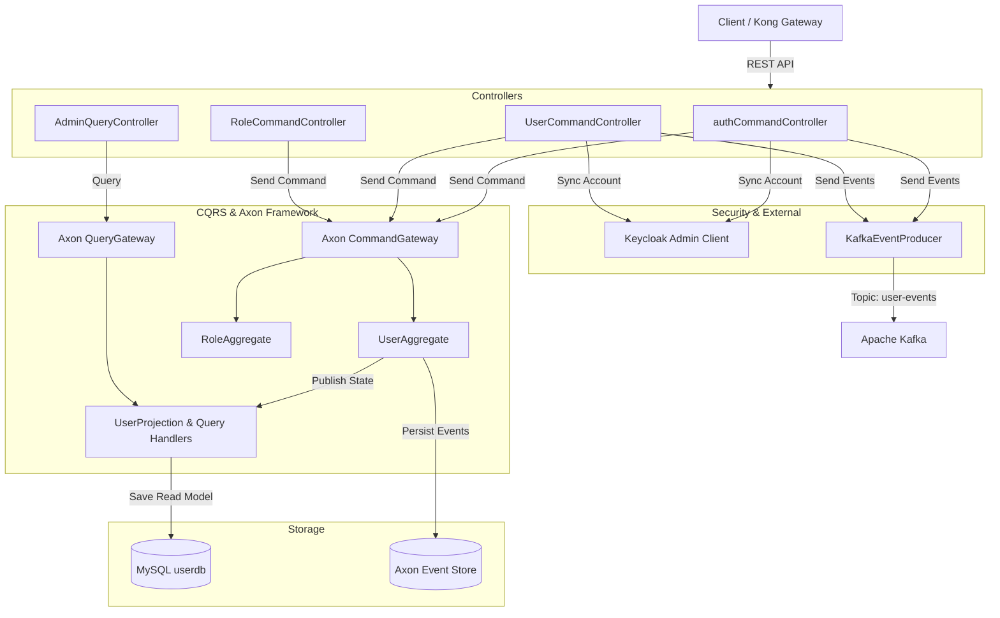

# 👤 User Service (Quản lý Người dùng & Xác thực)

`UserService` là service phụ trách quản lý danh tính người dùng, quy trình xác thực, cấp quyền phân quyền (RBAC - Role Based Access Control) và đồng bộ dữ liệu với **Keycloak IAM Server**. Service được xây dựng theo kiến trúc **CQRS** bằng **Axon Framework** và phát sinh sự kiện qua **Apache Kafka**.

---

## 📌 Thông tin tổng quan

- **Tên ứng dụng**: `user-service`
- **Port mặc định**: `8081`
- **Cơ sở dữ liệu**: MySQL (`userdb`) trên port `3308`
- **Swagger Documentation**: `http://localhost:8081/swagger-ui.html`
- **Tích hợp bảo mật**: Keycloak Realm `jobhuntly` (OAuth2 / OIDC JWT Resource Server)
- **Axon Server**: `localhost:8124`
- **Kafka Topic xuất bản**: `user-events`

---

## 🏗 Kiến trúc & Công nghệ



---

## 📋 Danh sách API Endpoints

### 1. Xác thực & Quản lý phiên làm việc (`/api/v1/auth`)

| Phương thức | Endpoint | Mô tả | Yêu cầu xác thực |
| :--- | :--- | :--- | :--- |
| `POST` | `/api/v1/auth/register` | Đăng ký tài khoản người dùng mới (Candidate / Recruiter) | Public |
| `POST` | `/api/v1/auth/login` | Đăng nhập hệ thống qua Keycloak Direct Grant | Public |
| `POST` | `/api/v1/auth/refresh` | Làm mới Access Token thông qua Refresh Token | Public |
| `POST` | `/api/v1/auth/logout` | Đăng xuất và hủy phiên làm việc trên Keycloak | Public |
| `POST` | `/api/v1/auth/verify-email` | Xác thực tài khoản qua email token | Public |
| `POST` | `/api/v1/auth/forgot-password` | Yêu cầu gửi mã khôi phục mật khẩu qua email | Public |
| `POST` | `/api/v1/auth/reset-password` | Đặt lại mật khẩu mới với mã xác thực | Public |
| `POST` | `/api/v1/auth/resend-verification` | Gửi lại email kích hoạt tài khoản | Public |

### 2. Quản lý Người dùng (`/api/v1/users`)

| Phương thức | Endpoint | Mô tả | Quyền / Ghi chú |
| :--- | :--- | :--- | :--- |
| `POST` | `/api/v1/users/assign-roles` | Gán danh sách vai trò cho một người dùng | Admin |
| `PUT` | `/api/v1/users/{id}/status` | Khóa hoặc kích hoạt tài khoản người dùng (`?active=true/false`) | `@PreAuthorize('hasAuthority(\"USER_BAN\")')` |
| `PUT` | `/api/v1/users/change-password` | Người dùng tự đổi mật khẩu cá nhân | Authenticated JWT |

### 3. Quản lý Vai trò & Quyền hạn (`/api/v1`)

| Phương thức | Endpoint | Mô tả |
| :--- | :--- | :--- |
| `POST` | `/api/v1/roles` | Tạo vai trò mới trong hệ thống |
| `PUT` | `/api/v1/roles/{id}` | Cập nhật thông tin vai trò |
| `DELETE` | `/api/v1/roles/{id}` | Xóa vai trò |
| `POST` | `/api/v1/permissions` | Tạo một quyền mới |
| `POST` | `/api/v1/permissions/batch` | Tạo hàng loạt quyền mới cùng lúc |
| `PUT` | `/api/v1/permissions/{id}` | Cập nhật quyền |
| `DELETE` | `/api/v1/permissions/{id}` | Xóa quyền |
| `POST` | `/api/v1/assign-permissions` | Gán danh sách quyền cho vai trò |

### 4. Truy vấn Quản trị & Thông tin cá nhân (`/api/v1/admin/users`)

| Phương thức | Endpoint | Mô tả |
| :--- | :--- | :--- |
| `GET` | `/api/v1/admin/users/me` | Lấy thông tin tài khoản hiện tại từ JWT subject |
| `GET` | `/api/v1/admin/users` | Danh sách người dùng (tìm kiếm theo email, userType, role, isActive, phân trang) |
| `GET` | `/api/v1/admin/users/{id}` | Chi tiết thông tin người dùng theo ID |
| `GET` | `/api/v1/admin/users/roles` | Lấy danh sách toàn bộ vai trò |
| `GET` | `/api/v1/admin/users/roles/{id}` | Lấy chi tiết vai trò và các quyền đính kèm |
| `GET` | `/api/v1/admin/users/permissions` | Lấy danh sách toàn bộ quyền hạn |
| `GET` | `/api/v1/admin/users/permissions/{id}` | Lấy chi tiết một quyền hạn |

---

## 📡 Kafka Events (Producer)

Service tự động gửi sự kiện vào topic `user-events` khi có thay đổi trạng thái người dùng:

| Event Type | Khi nào kích hoạt | Mục đích |
| :--- | :--- | :--- |
| `UserRegisteredEvent` | Người dùng hoàn tất đăng ký tài khoản | Kích hoạt gửi email chào mừng & thông báo in-app |
| `UserActivatedEvent` | Tài khoản được Admin mở khóa | Thông báo cho người dùng tài khoản đã hoạt động trở lại |
| `AccountLockedEvent` | Tài khoản bị Admin khóa | Thông báo cảnh báo khóa tài khoản |
| `PasswordChangedEvent` | Đổi mật khẩu thành công | Thông báo bảo mật qua email |

---

## ⚙ Cấu hình chính (`application.yaml`)

```yaml
server:
  port: 8081

spring:
  application:
    name: user-service
  datasource:
    url: jdbc:mysql://localhost:3308/userdb?useSSL=false&serverTimezone=Asia/Ho_Chi_Minh
    username: root
    password: <YOUR_PASSWORD>
  security:
    oauth2:
      resourceserver:
        jwt:
          issuer-uri: http://localhost:8080/realms/jobhuntly

keycloak:
  server:
    url: http://localhost:8080
  admin:
    username: admin
    password: admin
  realm: jobhuntly
  client-id: user-service
  client-secret: <CLIENT_SECRET>
```

---

## 🏃 Hướng dẫn chạy Service

```bash
# Di chuyển vào thư mục service
cd UserService

# Chạy với Maven
mvn spring-boot:run
```
